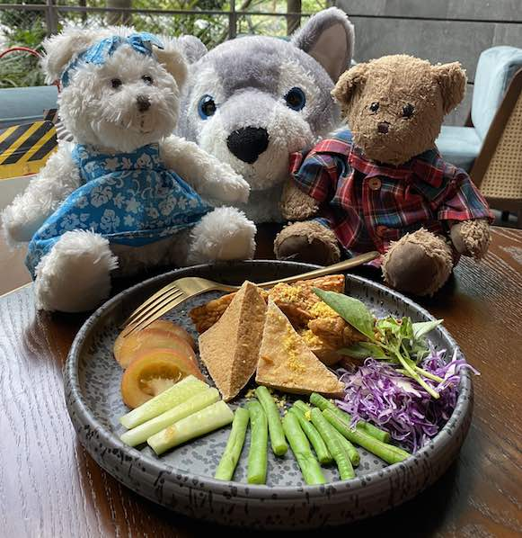

Brownie is a 2013 Stanford graduation bear. Lauri is a bear from Australia who loves to travel.
XiaoBai is a husky from the Seattle Zoo who protects Brownie and Lauri.
Here they are enjoying fried tempeh at the Jewel Changi Airport.

Jean and JJ met Lauri at the Sydney Airport in 2017 and thought that she'd be a great partner for Brownie.
Lauri made a long and difficult journey to the US a year later.
Ever since then, Brownie and Lauri have become inseparable (except when Brownie is greedy and wants all the food for himself).
Lauri and Brownie have graciously agreed to be the ring bears for Jean and JJ's wedding ceremony.
XiaoBai has volunteered to guard the dessert table.
